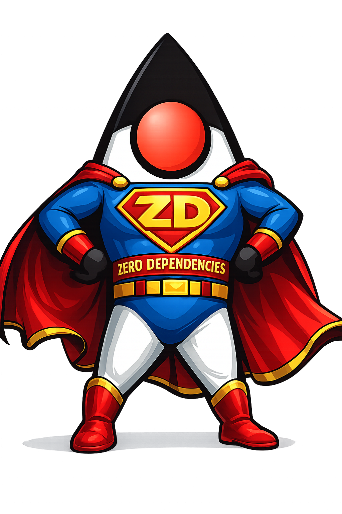

# z
Zero-Dependency Java Projects

A curated collection of Java projects following the "z" (zero) philosophy: no external dependencies, pure Java SE APIs. Each project is self-contained and can be copied directly into your codebase or used standalone.

## Projects

- [zb](https://github.com/AdamBien/zb) - Zero Dependencies Builder. A Java build tool for compilation and executable JAR generation.
- [zcfg](https://github.com/AdamBien/zcfg) - Zero Dependency Configuration Utility. A configuration loader for Java properties files with precedence rules.
- [zcl](https://github.com/AdamBien/zcl) - Zero Dependency Colour Logger. A logging utility with ANSI color support for console output.
- [zfsl](https://github.com/AdamBien/zfsl) - Zero Dependencies File Selection and Copy Tool. Interactive CLI for selective file copying with content preview.
- [zscro](https://github.com/AdamBien/zscro) - Zero Dependencies Script Reader. Searches for executables in PATH and displays their contents.
- [zsmith](https://github.com/AdamBien/zsmith) - Zero Dependencies AI Agent Framework. A Claude agent framework with tool execution support.
- [ztz](https://github.com/AdamBien/ztz) - Zero Dependencies Time Zone. Translates current local time to a specified time zone.
- [zws](https://github.com/AdamBien/zws) - Zero Dependencies Web Server. A development web server that serves files and opens the browser automatically.
